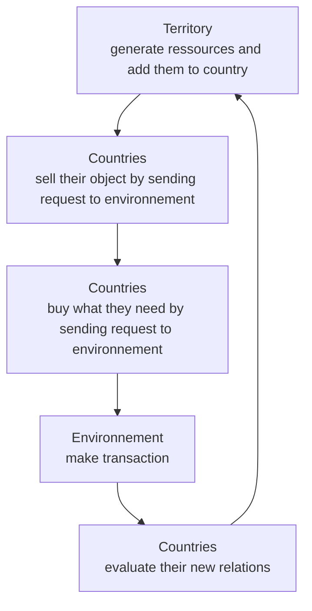

# Gopolitical

[](https://github.com/BaptisteBuvron/gopolitical/actions/workflows/test.yml)

Gopolitical is a multi-agent project developped to simulate trade and diplomatic relationships between countries.

- [Subject](https://docs.google.com/document/d/1H8QpU5dTMkJEEb2nTqgMNJ84rH7QNalC8CqPTC4qPV8)
- [Repository](https://github.com/BaptisteBuvron/gopolitical)

## Installation

### Server

Install [Go](https://golang.org/doc/install).

#### With git clone

```bash
git clone https://github.com/BaptisteBuvron/gopolitical
sudo go install .
# Start-Process powershell -Verb runAs -ArgumentList "cd $(Get-Location); go install"
```

#### Without git clone

```bash
go install github.com/BaptisteBuvron/gopolitical/server@v1.1.1
```

#### Customization of the Simulation Instance

It is possible to change the `/server/resources/data.json` file that will be interpreted by the simulation by default at launch. This file instructs the simulation about various countries, territories, stock variations, consumptions, etc.

It is possible to generate a `data.json` file using the Python script located in `/server/resources/generate_data.py`.

Run the server:

```bash
cd server
go run .
```

Run tests:

```bash
go test '-coverprofile=coverage.txt' -v ./...
go tool cover '-html=coverage.txt'
```

### Client

```bash
cd client
npm i
npm run start
```

## Loop


