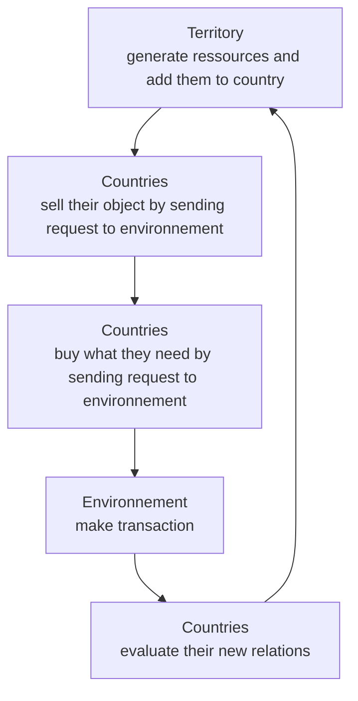

# Gopolitical

[](https://github.com/BaptisteBuvron/gopolitical/actions/workflows/test.yml)

- [Subject](https://docs.google.com/document/d/1H8QpU5dTMkJEEb2nTqgMNJ84rH7QNalC8CqPTC4qPV8)
- [Repository](https://github.com/BaptisteBuvron/gopolitical)

## Installation

### Server

Install [Go](https://golang.org/doc/install).

Clone the repository:

```bash
go install github.com/BaptisteBuvron/gopolitical/server@v1.0.0
```

Run the server:

```bash
server
```

Run tests:

```bash
go test '-coverprofile=coverage.txt' -v ./...
go tool cover '-html=coverage.txt'
```

### Client

```bash
cd client
npm i
npm run start
```

## Loop


